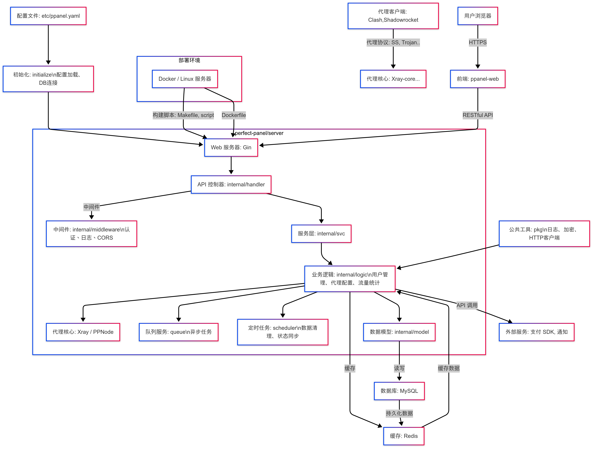

# PPanel 服务端

<div align="center">

[](LICENSE)
[](https://go.dev/)
[](https://goreportcard.com/report/github.com/perfect-panel/server)
[](Dockerfile)
[](.github/workflows/release.yml)

**PPanel 是一个纯净、专业、完美的开源代理面板工具，旨在成为您学习和实际使用的理想选择。**

[中文](README.md) | [English](README_EN.md) | [报告问题](https://github.com/perfect-panel/server/issues/new) | [功能请求](https://github.com/perfect-panel/server/issues/new)

</div>

> **第一条**  
> 人人生而自由，在尊严与权利上一律平等。  
> 他们赋有理性与良知，应当以兄弟般的精神彼此相待。  
>
> **第十二条**  
> 任何人的隐私、家庭、住宅和通信不得任意干涉，其名誉与荣誉不得加以攻击。  
> 人人有权受到法律的保护，以免遭受这种干涉或攻击。  
>
> **第十九条**  
> 人人有思想与表达的自由；此项自由包括持有主张而不受干预，以及通过任何媒介、无论国界，自由寻求、接受和传播信息与思想。  
>
> *来源： [United Nations – Universal Declaration of Human Rights (UN.org)](https://www.un.org/sites/un2.un.org/files/2021/03/udhr.pdf)*

## 📋 概述

PPanel 服务端是 PPanel 项目的后端组件，为代理服务提供强大的 API 和核心功能。它基于 Go 语言开发，注重性能、安全性和可扩展性。

### 核心特性

- **多协议支持**：支持 Shadowsocks、V2Ray、Trojan 等多种加密协议。
- **隐私保护**：不收集用户日志，确保隐私和安全。
- **极简设计**：简单易用，保留完整的业务逻辑。
- **用户管理**：完善的认证和授权系统。
- **订阅管理**：处理用户订阅和服务开通。
- **支付集成**：支持多种支付网关。
- **订单管理**：跟踪和处理用户订单。
- **工单系统**：内置客户支持和问题跟踪。
- **节点管理**：监控和控制服务器节点。
- **API 框架**：提供全面的 RESTful API，供前端集成。

## 🚀 快速开始

### 前提条件

- **Go**：1.25 或更高版本
- **Docker**：可选，用于容器化部署
- **Git**：用于克隆仓库

### 通过源代码运行

1. **克隆仓库**：
   ```bash
   git clone https://github.com/perfect-panel/ppanel-server.git
   cd ppanel-server
   ```

2. **安装依赖**：
   ```bash
   go mod download
   ```

3. **构建项目**：
   ```bash
   make linux-amd64
   ```

4. **启动服务器**：
   ```bash
   ./ppanel-server-linux-amd64 run --config etc/ppanel.yaml
   ```

### 🐳 Docker 部署

1. **构建 Docker 镜像**：
   ```bash
   docker buildx build --platform linux/amd64 -t ppanel-server:latest .
   ```

2. **运行容器**：
   ```bash
   docker run --rm -p 8080:8080 -v $(pwd)/etc:/app/etc ppanel-server:latest
   ```

3. **使用 Docker Compose**（创建 `docker-compose.yml`）：
   ```yaml
   version: '3.8'
   services:
     ppanel-server:
       image: ppanel-server:latest
       ports:
         - "8080:8080"
       volumes:
         - ./etc:/app/etc
       environment:
         - TZ=Asia/Shanghai
   ```
   运行：
   ```bash
   docker-compose up -d
   ```

4. **从 Docker Hub 拉取**（CI/CD 发布后）：
   ```bash
   docker pull ppanel/ppanel-server:latest
   docker run --rm -p 8080:8080 ppanel/ppanel-server:latest
   ```

## 📖 API 文档

API 文档使用 Handler 上的 Swaggo 注解生成，并通过 Hertz 实际注册路由进行完整性校验。根目录的 `ppanel.json` 是完整 Swagger 2.0 文档：

[ppanel.json](./ppanel.json)

修改路由、请求 DTO 或响应 DTO 后，运行：

```bash
./script/generate-swagger.sh
go test ./internal/transport/http/routes -run '^TestSwagger' -count=1
```

`master` 分支的 GitHub Actions 会生成 `ppanel.json` 以及 `admin.json`、`user.json`、`common.json`、`node.json` 分类文档，并同步到 `perfect-panel/ppanel-docs` 的 `public/swagger` 目录。现有 `GH_TOKEN` secret 需要对文档仓库具有 Contents 写权限。

## 🔗 相关项目

| 项目               | 描述           | 链接                                                    |
|------------------|--------------|-------------------------------------------------------|
| PPanel Web       | PPanel 前端应用  | [GitHub](https://github.com/perfect-panel/frontend) |
| PPanel User Web  | PPanel 用户界面  | [预览](https://user.ppanel.dev)                         |
| PPanel Admin Web | PPanel 管理员界面 | [预览](https://admin.ppanel.dev)                        |

## 🌐 官方网站

访问 [ppanel.dev](https://ppanel.dev) 获取更多信息。

## 🏛 系统架构



## 📁 目录结构

```
.
├── cmd/              # 应用程序入口
├── docs/             # 文档（使用指南、贡献指南、设计文档）
├── etc/              # 配置文件（如 ppanel.yaml）
├── internal/         # 内部模块
│   ├── app/          # 应用组装、初始化、迁移与定时调度
│   ├── arch/         # 架构边界检查
│   ├── auth/         # 跨模块认证能力
│   ├── config/       # 配置文件解析
│   ├── infra/        # 邮件、短信、共享任务消息等基础设施
│   ├── module/       # 业务模块（门面、contract、transport/http 与内部实现）
│   ├── repository/   # 仓储契约与事务组装
│   └── transport/    # HTTP、WebSocket 与任务消费
├── pkg/              # 公共工具代码
├── script/           # 安装脚本
├── scripts/          # 性能测试与维护脚本
├── go.mod            # Go 模块定义
├── Makefile          # 构建自动化
└── Dockerfile        # Docker 配置
```

## 💻 开发

### 多平台构建

使用 `Makefile` 构建多种平台（如 Linux、Windows、macOS）：

```bash
make all  # 构建 linux-amd64、darwin-amd64、windows-amd64
make linux-arm64  # 构建特定平台
```

支持的平台包括：

- Linux：`386`、`amd64`、`arm64`、`armv5-v7`、`mips`、`riscv64`、`loong64` 等
- Windows：`386`、`amd64`、`arm64`、`armv7`
- macOS：`amd64`、`arm64`
- FreeBSD：`amd64`、`arm64`

## 🤝 贡献

欢迎各种贡献，包括功能开发、错误修复和文档改进。请查看[贡献指南](docs/contributing/CONTRIBUTING_ZH.md)了解详情。

## ✨ 特别感谢

感谢以下优秀的开源项目，它们为本项目的开发提供了强大的支持！ 🚀

<div style="overflow-x: auto;">
<table style="width: 100%; border-collapse: collapse; margin: 20px 0;">
  <thead>
    <tr style="background-color: #f5f5f5;">
      <th style="padding: 10px; text-align: center;">项目</th>
      <th style="padding: 10px; text-align: left;">描述</th>
      <th style="padding: 10px; text-align: center;">项目</th>
      <th style="padding: 10px; text-align: left;">描述</th>
    </tr>
  </thead>
  <tbody>
    <tr>
      <td align="center" style="padding: 15px; vertical-align: middle;">
        <a href="https://www.cloudwego.io/zh/docs/hertz/" style="text-decoration: none;">
          <strong>Hertz</strong><br/>
          
        </a>
      </td>
      <td style="padding: 15px; vertical-align: middle;">
        高性能的 Go HTTP 框架<br/>
      </td>
      <td align="center" style="padding: 15px; vertical-align: middle;">
        <a href="https://gorm.io/" style="text-decoration: none;">
          <br/>
          <strong>Gorm</strong><br/>
          
        </a>
      </td>
      <td style="padding: 15px; vertical-align: middle;">
        功能强大的 Go ORM 框架<br/>
      </td>
    </tr>
    <tr>
      <td align="center" style="padding: 15px; vertical-align: middle;">
        <a href="https://github.com/hibiken/asynq" style="text-decoration: none;">
          <br/>
          <strong>Asynq</strong><br/>
          
        </a>
      </td>
      <td style="padding: 15px; vertical-align: middle;">
        Go 语言的异步任务队列<br/>
      </td>
      <td align="center" style="padding: 15px; vertical-align: middle;">
        <a href="https://goswagger.io/" style="text-decoration: none;">
          <br/>
          <strong>Go-Swagger</strong><br/>
          
        </a>
      </td>
      <td style="padding: 15px; vertical-align: middle;">
        完整的 Go Swagger 工具集<br/>
      </td>
    </tr>
  </tbody>
</table>
</div>

---

🎉 **致敬开源**：感谢开源社区，让开发变得更简单、更高效！欢迎为这些项目点亮 ⭐，支持开源事业！

## 📄 许可证

本项目采用 [GPL-3.0 许可证](LICENSE) 授权。
