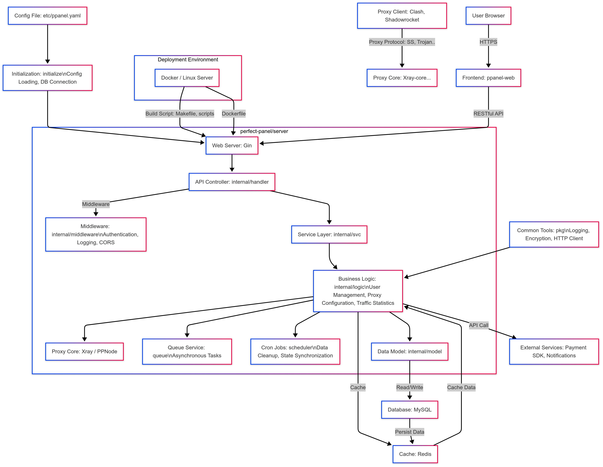

# PPanel Server

<div align="center">

[](LICENSE)
[](https://go.dev/)
[](https://goreportcard.com/report/github.com/perfect-panel/server)
[](Dockerfile)
[](.github/workflows/release.yml)

**PPanel is a pure, professional, and perfect open-source proxy panel tool, designed for learning and practical use.**

[English](README_EN.md) | [中文](README.md) | [Report Bug](https://github.com/perfect-panel/server/issues/new) | [Request Feature](https://github.com/perfect-panel/server/issues/new)

</div>

> **Article 1.**  
> All human beings are born free and equal in dignity and rights.  
> They are endowed with reason and conscience and should act towards one another in a spirit of brotherhood.
>
> **Article 12.**  
> No one shall be subjected to arbitrary interference with his privacy, family, home or correspondence, nor to attacks upon his honour and reputation.  
> Everyone has the right to the protection of the law against such interference or attacks.
>
> **Article 19.**  
> Everyone has the right to freedom of opinion and expression; this right includes freedom to hold opinions without interference and to seek, receive and impart information and ideas through any media and regardless of frontiers.
>
> *Source: [United Nations – Universal Declaration of Human Rights (UN.org)](https://www.un.org/sites/un2.un.org/files/2021/03/udhr.pdf)*

## 📋 Overview

PPanel Server is the backend component of the PPanel project, providing robust APIs and core functionality for managing
proxy services. Built with Go, it emphasizes performance, security, and scalability.

### Key Features

- **Multi-Protocol Support**: Supports Shadowsocks, V2Ray, Trojan, and more.
- **Privacy First**: No user logs are collected, ensuring privacy and security.
- **Minimalist Design**: Simple yet powerful, with complete business logic.
- **User Management**: Full authentication and authorization system.
- **Subscription System**: Manage user subscriptions and service provisioning.
- **Payment Integration**: Supports multiple payment gateways.
- **Order Management**: Track and process user orders.
- **Ticket System**: Built-in customer support and issue tracking.
- **Node Management**: Monitor and control server nodes.
- **API Framework**: Comprehensive RESTful APIs for frontend integration.

## 🚀 Quick Start

### Prerequisites

- **Go**: 1.25 or higher
- **Docker**: Optional, for containerized deployment
- **Git**: For cloning the repository

### Installation from Source

1. **Clone the repository**:
   ```bash
   git clone https://github.com/perfect-panel/ppanel-server.git
   cd ppanel-server
   ```

2. **Install dependencies**:
   ```bash
   go mod download
   ```

3. **Build the project**:
   ```bash
   make linux-amd64
   ```

4. **Run the server**:
   ```bash
   ./ppanel-server-linux-amd64 run --config etc/ppanel.yaml
   ```

### 🐳 Docker Deployment

1. **Build the Docker image**:
   ```bash
   docker buildx build --platform linux/amd64 -t ppanel-server:latest .
   ```

2. **Run the container**:
   ```bash
   docker run --rm -p 8080:8080 -v $(pwd)/etc:/app/etc ppanel-server:latest
   ```

3. **Use Docker Compose** (create `docker-compose.yml`):
   ```yaml
   version: '3.8'
   services:
     ppanel-server:
       image: ppanel-server:latest
       ports:
         - "8080:8080"
       volumes:
         - ./etc:/app/etc
       environment:
         - TZ=Asia/Shanghai
   ```
   Run:
   ```bash
   docker-compose up -d
   ```

4. **Pull from Docker Hub** (after CI/CD publishes):
   ```bash
   docker pull ppanel/ppanel-server:latest
   docker run --rm -p 8080:8080 ppanel/ppanel-server:latest
   ```

## 📖 API Documentation

API documentation is generated from Swaggo annotations on the handlers and checked against the routes actually registered by Hertz. The root `ppanel.json` is the complete Swagger 2.0 document:

[ppanel.json](ppanel.json)

After changing a route, request DTO, or response DTO, run:

```bash
./script/generate-swagger.sh
go test ./internal/transport/http/routes -run '^TestSwagger' -count=1
```

GitHub Actions on `master` generates the full document plus the `admin.json`, `user.json`, `common.json`, and `node.json` scopes, then syncs them to `public/swagger` in `perfect-panel/ppanel-docs`. The existing `GH_TOKEN` secret needs Contents write access to the documentation repository.

## 🔗 Related Projects

| Project          | Description                | Link                                                  |
|------------------|----------------------------|-------------------------------------------------------|
| PPanel Web       | Frontend for PPanel        | [GitHub](https://github.com/perfect-panel/frontend) |
| PPanel User Web  | User interface for PPanel  | [Preview](https://user.ppanel.dev)                    |
| PPanel Admin Web | Admin interface for PPanel | [Preview](https://admin.ppanel.dev)                   |

## 🌐 Official Website

Visit [ppanel.dev](https://ppanel.dev/) for more details.

## 🏛 Architecture



## 📁 Directory Structure

```
.
├── cmd/              # Application entry point
├── docs/             # Documentation
├── etc/              # Configuration files (e.g., ppanel.yaml)
├── internal/         # Internal modules
│   ├── app/          # Assembly, bootstrap, migrations and scheduling
│   ├── arch/         # Architecture boundary checks
│   ├── auth/         # Shared authentication capabilities
│   ├── config/       # Configuration parsing
│   ├── infra/        # Mail, SMS, shared task messages and infrastructure
│   ├── module/       # Business facades, contracts, entities and adapters
│   ├── repository/   # Repository contracts and transaction assembly
│   └── transport/    # HTTP, WebSocket and task consumers
├── pkg/              # Utility code
├── script/           # Installation scripts
├── scripts/          # Performance and maintenance scripts
├── go.mod            # Go module definition
├── Makefile          # Build automation
└── Dockerfile        # Docker configuration
```

## 💻 Development

### Build for Multiple Platforms

Use the `Makefile` to build for various platforms (e.g., Linux, Windows, macOS):

```bash
make all  # Builds linux-amd64, darwin-amd64, windows-amd64
make linux-arm64  # Build for specific platform
```

Supported platforms include:

- Linux: `386`, `amd64`, `arm64`, `armv5-v7`, `mips`, `riscv64`, `loong64`, etc.
- Windows: `386`, `amd64`, `arm64`, `armv7`
- macOS: `amd64`, `arm64`
- FreeBSD: `amd64`, `arm64`

## 🤝 Contributing

Contributions are welcome! Please follow the [Contribution Guidelines](docs/contributing/CONTRIBUTING.md) for bug fixes, features, or
documentation improvements.

## ✨ Special Thanks

A huge thank you to the following outstanding open-source projects that have provided invaluable support for this
project's development! 🚀

<div style="overflow-x: auto;">
<table style="width: 100%; border-collapse: collapse; margin: 20px 0;">
  <thead>
    <tr style="background-color: #f5f5f5;">
      <th style="padding: 10px; text-align: center;">Project</th>
      <th style="padding: 10px; text-align: left;">Description</th>
      <th style="padding: 10px; text-align: center;">Project</th>
      <th style="padding: 10px; text-align: left;">Description</th>
    </tr>
  </thead>
  <tbody>
    <tr>
      <td align="center" style="padding: 15px; vertical-align: middle;">
        <a href="https://www.cloudwego.io/docs/hertz/" style="text-decoration: none;">
          <strong>Hertz</strong><br/>
          
        </a>
      </td>
      <td style="padding: 15px; vertical-align: middle;">
        High-performance Go HTTP framework<br/>
      </td>
      <td align="center" style="padding: 15px; vertical-align: middle;">
        <a href="https://gorm.io/" style="text-decoration: none;">
          <br/>
          <strong>Gorm</strong><br/>
          
        </a>
      </td>
      <td style="padding: 15px; vertical-align: middle;">
        Powerful Go ORM framework<br/>
      </td>
    </tr>
    <tr>
      <td align="center" style="padding: 15px; vertical-align: middle;">
        <a href="https://github.com/hibiken/asynq" style="text-decoration: none;">
          <br/>
          <strong>Asynq</strong><br/>
          
        </a>
      </td>
      <td style="padding: 15px; vertical-align: middle;">
        Asynchronous task queue for Go<br/>
      </td>
      <td align="center" style="padding: 15px; vertical-align: middle;">
        <a href="https://goswagger.io/" style="text-decoration: none;">
          <br/>
          <strong>Go-Swagger</strong><br/>
          
        </a>
      </td>
      <td style="padding: 15px; vertical-align: middle;">
        Comprehensive Go Swagger toolkit<br/>
      </td>
    </tr>
  </tbody>
</table>
</div>

---

🎉 **Salute to Open Source**: Thank you to the open-source community for making development simpler and more efficient!
Please give these projects a ⭐ to support the open-source movement!
## 📄 License

This project is licensed under the [GPL-3.0 License](LICENSE).
